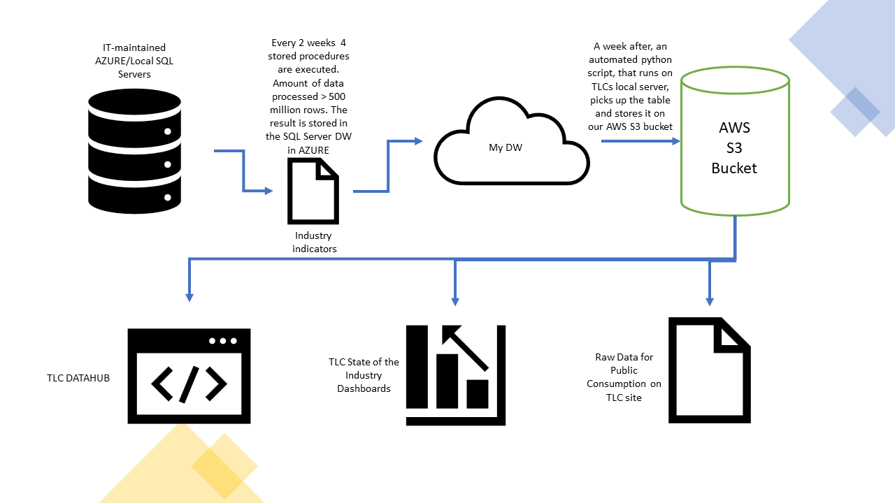

# Industry Indicators ETL presentation

# Overview

The Data Team, collaborating with IT, built out a data warehouse that automatically aggregates the most often requested data points on a set schedule, drastically increasing the speed with which data can be pulled and analyzed. Most tables in the warehouse update automatically and run on a set schedule. The purpose of this documentation is to give an overall scope of the project and present a portion of the project as presentation.

# Requirements

## Business Requirements

1. Who is the requestor(s) of this project

    - TLC Policy Division
    - TLC Executive Office

2. What problem the project aims to solve

The project is a response to the challenges that the data team is facing day-to-day when working with the existing infrastracture. We work on big projects that require quick data access. We also often respond to daily ad-hoc requests from internal (Commissioner, DCs, Press People, External Affairs, etc) and external stakeholders (Press, Politicians, Vendors). The data are big and its raw form is very hard to work with. It sometimes can take multiple hours for a simple query to finish.  

3. Timeframes (start date, deadline...)

Start: 05-01-2020, deadline: ongoing

## Technical Requirements

1. Technology used (programming stack, other software like Tableau?)

    - MS T-SQL 
    - SQL Server 
    - SSMS 
    - Python 
    - R

2. Permissions/access to folders required and where obtained

There are multiple permissions required for this project.

    1.AZURE multifactor auth provided by IT
    2.Admin priveleges for leads with the ability to create roles for devs and analysts
    3.Access to the Job Scheduler 
    4.Persmissons to create and run stored procedures
    5.Access to the FTP server to access raw data
    6.Access to the resource and billing dashboard on AZURE

3. Databases/servers used (internal and external data sources)

    1. MS SQL Server, TPEP Trip Server
    2. FTP server to access raw data

4. Code location

    1. Internal TLC server
    2. Azure Git Repos

## Personnel Requirements

| Name | Role | Email |
|--|--|--|
| NIkita Voevodin | Product Owner/Developer | tbd@tlc.nyc.gov |
| hidden | Product Owner | tbd@tlc.nyc.gov |
| hidden | Co-Developer | tbd@tlc.nyc.gov |
| hidden | Co Developer/GS Specialist | tbd@tlc.nyc.gov |
| hidden | Co Developer/ML Specialist | tbd@tlc.nyc.gov |
| hidden | Co Developer/BI Analyst | tbd@tlc.nyc.gov |
| hidden | QA | tbd@tlc.nyc.gov |

# Development Workflow

Detailed description of how the project/requirement was completed. A new reader should be able to understand and follow the workflow that you outline here.

This is a big project and it had a few major stages:

## Internal Planning

- Discussions about the tech stack
- Discussions about available resources
- Discussions about the needs (tables, views, most requested metrics, usage, benefits)
- Discussions about the roles
- Discussions about data governance (standardization_work.pptx)
- Timelines and milestones

## Permissons and Infrastructure Provisioning

- Presentation to the Deputy Commissioner of Policy/Data
- Prioritization vote with all the departments heads
- Request for resources to the procurement team
- Provisioning of a separate azure server (admin rights, security settings, etc) 
- Prototyping and server tests

## Development

- First batch of ~30 tables, more or less, evenly split between 4 devs
- Helpful templates for sql scripts and stored procedures produced together with IT DB Admins
- First milestone: 45 days. 30 working tables produced
- QA testing (QA at IT + data analysts at the data team)
- Job scheduling
- Documentation

## Maintenance and Additions

- Addition of new 25 tables
- Creation of pivot views
- Opening of the server to other departments
- Linking tables to BI tools

# Use Workflow

Minimal use example (Step by step). If not applicable - explain why.

## Industry Indicators
Industry Indicators Table is one of 55 current reports maintained by the DW. Industry Indicators are a set of published metrics that are updated every month and reviewed with the commissioner before releasing to the public. They cover a myriad of relevant metrics for the industries we regulate.

### Usecases

The Industry Indicators is one of the most important datasets that the Policy Division produces. It informs our policy decisions, used by outside stakeholders, and feeds multiple public tools that we developed and maintain. To help you better understand the pipelines that make this and other reports happen here is a couple of diagrams:

## TLC TRIP DATA FLOW

The diagram above show a more general flow of trip data from our vendors (companies) to our main DB -> DW and local Repos -> BI Tools and Public.

## INDUSTRY INDICATORS LIFECYCLE

This diagram shows the lifecycle of the Industry Indicators report. Here are the steps:

1. 3 stored procedures (shl_agg_stored_procedure.sql, medallion_agg_stored_procedure.sql, fhv_agg_stored_procedure.sql ) are executed every 2 weeks on Tue at 2am populating 3 interim tables. Amount of data processed is around 500 million rows.
2. Final stored procedure (combining_stored_procedure.sql) puts everything together
3. The specs for the final table is in data_reports_monthly_indicators_all.xlsx (attached to the repo)
4. The final table (data_reports_monthly.csv) feeds the preview dashboard.
5. The head of data reviews the metrics and presents to the Commissioner to get the final green light to publish.
6. This is the only (potential) manual step in this chain. In case of any data integrity issues, the head of data needs to stop the pipe to look into the issue.
7. Once greenlit, a scheduled python script picks up the data and stores it in our AWS s3 bucket
8. That file feeds the dataset on our website (https://www1.nyc.gov/site/tlc/about/aggregated-reports.page)
9. One of the State of the Industry dashboards (https://analytics-tlc.github.io/state_of_industry_preview/)
10. Industry Indicators Data Hub View (https://tlcanalytics.shinyapps.io/datahub/)

### Public Dataset

The table is published on TLC website with the following columns: License Class, Trips Per Day, Farebox Per Day, Unique Drivers ,Unique Vehicles, Vehicles Per Day, Avg Days Vehicles on Road, Avg Hours Per Day Per Vehicle, Avg Days Drivers on Road , Avg Hours Per Day Per Driver, Avg Minutes Per Trip, Percent of Trips Paid with Credit Card, Trips Per Day Shared. This dataset is used by a ton of external stakeholders within the city and a bunch of interested entities all over the world. 

*Location: https://www1.nyc.gov/assets/tlc/downloads/csv/data_reports_monthly.csv*

### TLC DATA HUB

TLC DATAHUB is an interactive and dynamic app that is publicly available and allows for easier access to the data that we work with and release. The Industry indicators dataset feeds that app and has a whole separate dashboard spot in it.

*Location: https://tlcanalytics.shinyapps.io/datahub/*

### State of the Industry

The State of the Industry makes TLC data easily digestible for the public and reflects the agency’s main monthly stats. Initially, it was meant as a supplement to the Commissioner’s monthly data updates. However, it became very popular and was requested to be made public. The portal is divided into the separate reports (Monthly Trips, Trips by Borough, Industry Indicators, HVFHV Wait times, and LL31 – Monthly Crashes) 

*Location: https://analytics-tlc.github.io/state_of_industry_preview/*

# Data Classification

Describe nature of data. Is it sensitive or not. Public or not. Can/should/will be released or not ...

*Please refer to the standardization_work.pptx document for my rules and recomendations for this project.*

# Authentication

TLC Employees authenticate to the Azure Server using their network email address and password. Multi-factor authentication is enabled for these users. Authentication is provided and managed by IT. An Admin can create roles for devs and users.

#Other

Other relevant information here.

