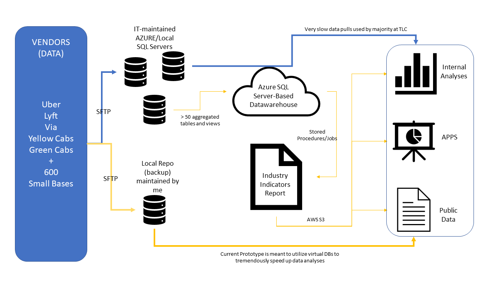

# Industry Indicators ETL presentation

# Overview

The Data Team, collaborating with IT, built out a data warehouse that automatically aggregates the most often requested data points on a set schedule, drastically increasing the speed with which data can be pulled and analyzed. Most tables in the warehouse update automatically and run on a set schedule. The purpose of this documentation is to give an overall scope of the project and present a portion of the project as presentation.

# Requirements

## Business Requirements

1. Who is the requestor(s) of this project

    -TLC Policy Division
    -TLC Execution Office

2. What problem the project aims to solve

The project is a response to the challenges that the data team is facing day-to-day when working with the existing infrastracture. We work on big projects that require quick data access. We also often respond to daily ad-hoc requests from internal (Commissioner, DCs, Press People, External Affairs, etc) and external stakeholders (Press, Politicians, Vendors). The data are big and its raw form is very hard to work with. It sometimes can take multiple hours for a simple query to finish.  

3. Timeframes (start date, deadline...)

Start: 05-01-2020, deadline: ongoing

## Technical Requirements

1. Technology used (programming stack, other software like Tableau?)

    -MS T-SQL, SQL Server, SSMS, Python, R

2. Permissions/access to folders required and where obtained

There are multiple permissions required for this project.

    1.AZURE multifactor auth provided by IT
    2.Admin priveleges for leads with the ability to create roles for devs and analysts
    3.Access to the Job Scheduler 
    4.Persmissons to create and run stored procedures
    5.Access to the FTP server to access raw data
    6.Access to the resource and billing dashboard on AZURE

3. Databases/servers used (internal and external data sources)

    1. MS SQL Server, TPEP Trip Server
    2. FTP server to access raw data

4. Code location

    1. Internal TLC server
    2. Azure Git Repos

## Personnel Requirements

| Name | Role | Email |
|--|--|--|
| NIkita Voevodin | Product Owner/Developer | tbd@tlc.nyc.gov |
| hidden | Product Owner | tbd@tlc.nyc.gov |
| hidden | Co-Developer | tbd@tlc.nyc.gov |
| hidden | Co Developer/GS Specialist | tbd@tlc.nyc.gov |
| hidden | Co Developer/ML Specialist | tbd@tlc.nyc.gov |
| hidden | Co Developer/BI Analyst | tbd@tlc.nyc.gov |
| hidden | QA | tbd@tlc.nyc.gov |

# Development Workflow

Detailed description of how the project/requirement was completed. A new reader should be able to understand and follow the workflow that you outline here.

 

# Use Workflow

Minimal use example (Step by step). If not applicable - explain why.

## Industry Indicators
Industry Indicators Table is one of 55 current reports maintained by the DW. Industry Indicators are a set of published metrics that are updated every month and reviewed with the commissioner before releasing to the public. They cover a myriad of relevant metrics for the industries we regulate.

### Usecases

The Industry Indicators is one of the most important datasets that the Policy Division produces. It informs our policy decisions, used by outside stakeholders, and feeds multiple public tools that we developed and maintain. To help you better understand the pipelines that make this and other reports happen here is a couple of diagrams:

# Public Dataset

The table is published on TLC website with the following columns: License Class, Trips Per Day, Farebox Per Day, Unique Drivers ,Unique Vehicles, Vehicles Per Day, Avg Days Vehicles on Road, Avg Hours Per Day Per Vehicle, Avg Days Drivers on Road , Avg Hours Per Day Per Driver, Avg Minutes Per Trip, Percent of Trips Paid with Credit Card, Trips Per Day Shared. 

*Location: https://www1.nyc.gov/assets/tlc/downloads/csv/data_reports_monthly.csv*

# Data Classification

Describe nature of data. Is it sensitive or not. Public or not. Can/should/will be released or not ...

*Please refer to the standardization_work.pptx document for my rules and recomendations for this project.*

# Authentication

TLC Employees authenticate to the Azure Server using their network email address and password. Multi-factor authentication is enabled for these users. Authentication is provided and managed by IT.

#Other

Other relevant information here.

